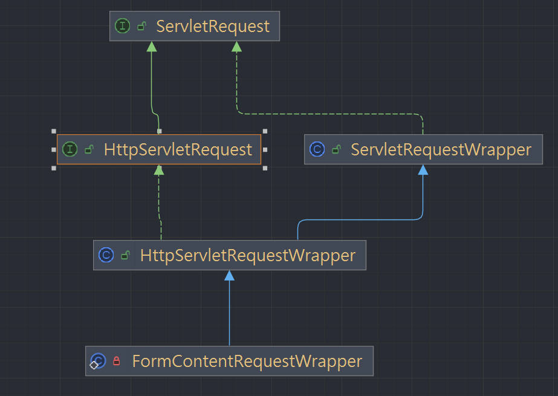
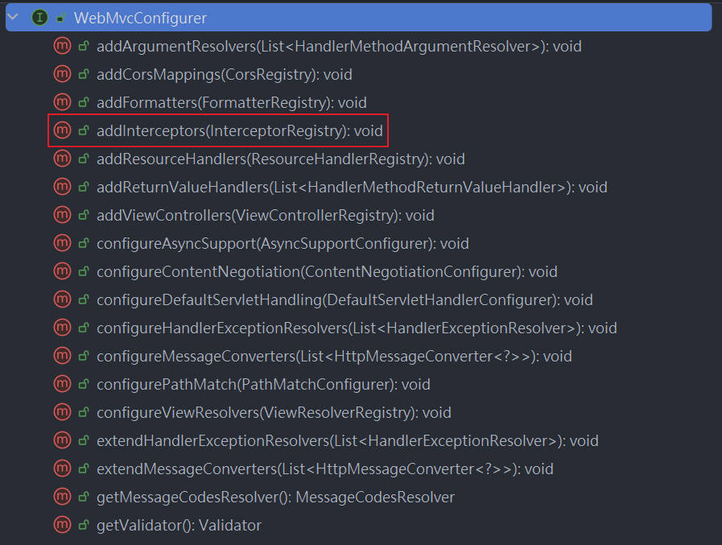
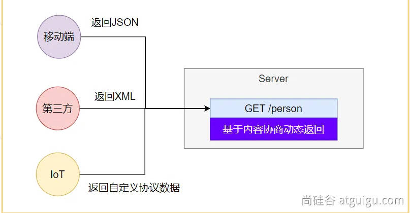
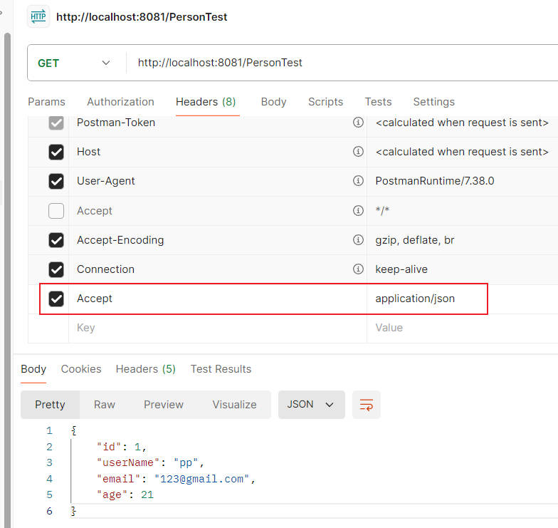
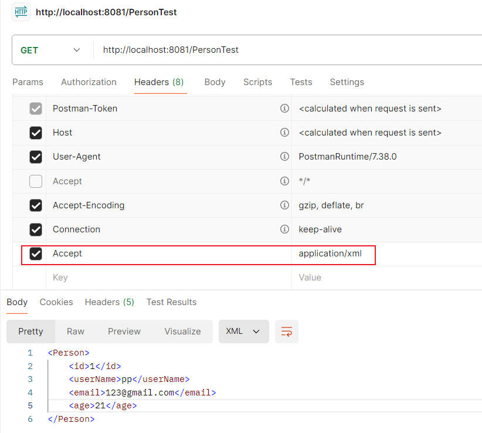

---
aliases:
  - springboot3
  - spring-boot-3

Created-Date: 2024-06-07T12:32:00
Last-Modified-Date: 2024-06-07T12:32:00
學習資源: "尚硅谷影片"
學習影片連結: "https://www.bilibili.com/video/BV1Es4y1q7Bf?p=4&spm_id_from=pageDriver&vd_source=761768e2c11632de30fd3e6fab20e591"
影片筆記連結: https://www.yuque.com/leifengyang/springboot3/vznmdeb4kgn90vrx#cYdbS
---

# Spring-Boot3-Web 開發

## Web 的自動配置流程與默認配置

### 自動配置

- 1.導入 maven dependency

    ```xml
        <dependency>
            <groupId>org.springframework.boot</groupId>
            <artifactId>spring-boot-starter-web</artifactId>
        </dependency>
    ```

- 2.spring-boot 註冊 auto configuration

    spring-boot 會透過 `@SpringBootApplication`&rarr;`@EnableAutoConfiguration`&rarr;`@Import(AutoConfigurationImportSelector.class)`去註冊`AutoConfigurationImportSelector`成為 Bean。

    接者透過`AutoConfigurationImportSelector`&rarr;`getCandidateConfigurations()`&rarr;`ImportCandidates.load()`去加載`META-INF/spring/org.springframework.boot.autoconfigure.AutoConfiguration.imports`裡定義的自動配置類。

    而在這些自動配置類中，會透過條件註解去判斷此自動配置類是否要生效。

    有的自動配置類會透過`@EnableConfigurationProperties`去綁定`xxxProperties.class`，而這個**屬性配置類**會透過`@ConfigurationProperties`去綁定到`application.properties`的屬性上。

    補充:條件註解是成立時才會把 class 放到 IOC Container，而不是先放到 IOC Container 再判斷自動配置類是否該生效。

- 3.所有 Web 相關的自動配置類如下(不含響應式場景):

    ```file
    org.springframework.boot.autoconfigure.web.client.RestTemplateAutoConfiguration
    org.springframework.boot.autoconfigure.web.embedded.EmbeddedWebServerFactoryCustomizerAutoConfiguration
    org.springframework.boot.autoconfigure.web.servlet.DispatcherServletAutoConfiguration
    org.springframework.boot.autoconfigure.web.servlet.ServletWebServerFactoryAutoConfiguration
    org.springframework.boot.autoconfigure.web.servlet.error.ErrorMvcAutoConfiguration
    org.springframework.boot.autoconfigure.web.servlet.HttpEncodingAutoConfiguration
    org.springframework.boot.autoconfigure.web.servlet.MultipartAutoConfiguration
    org.springframework.boot.autoconfigure.web.servlet.WebMvcAutoConfiguration
    ```

- 4.`application.properties`中 Web 相關的設定:
  - 1.spring MVC 相關配置: prefix = `spring.mvc`。
  - 2.Web 相關配置: prefix = `spring.web`。
  - 3.文件上傳配置: prefix = `spring.servlet.multipart`。
  - 4.Web server 相關配置: prefix = `server`。

### 默認配置

1. 包含了 ContentNegotiatingViewResolver 和 BeanNameViewResolver 元件，方便視圖解析。

    這是給 Thymeleaf、jsp 這些前後端不分離的項目使用的，若是前後端分離就直接 return json 數據而已。

2. 預設的靜態資源處理機制： 靜態資源放在 static 資料夾下即可直接存取。

3. 自動註冊了 Converter,GenericConverter,Formatter元件，適配常見資料類型轉換和格式化需求。

    目前理解是，spring-boot 在把 `application.properties`的屬性綁定到 class 上時要使用的。

    因為在`application.properties`裡的值都只是 string，因此綁定到 class 上時要進行類型轉換跟格式化，譬如`day=2024/06/07`&rarr;`Date day;`就要進行類型上的轉換及決定日期格式的樣子，而這些就是 Converter、Formatter 的功能。

4. 支援 HttpMessageConverters，可以方便返回json等資料類型。

    當使用`@ResponseBody`時，spring-boot 會把 return 的物件轉換成 json 格式，若是 return string 則直接輸出，這就是 HttpMessageConverters 的功能。

5. 註冊 MessageCodesResolver，方便國際化及錯誤訊息處理。
6. 支援 靜態 index.html。
7. 自動使用ConfigurableWebBindingInitializer，實現訊​​息處理、資料綁定、型別轉換、資料校驗等功能。

#### 重要

- 如果想在 spring-boot 提供的 mvc 默認配置上，自定義更多的 mvc 配置，譬如添加 interceptor、formatters 等。那可以使用`@Configuration` + implement `WebMvcConfigurer.interface`在配置類上，但**不要添加`@EnableWebMvc`**。

- 如果想要保持 spring-boot 提供的 mvc 默認配置，但要自訂核心元件實例，例如：RequestMappingHandlerMapping, RequestMappingHandlerAdapter, 或ExceptionHandlerExceptionResolver，給容器中放一個 WebMvcRegistrations 元件即可。

- 如果想全面接管 Spring MVC，也就是不使用任何 spring-boot 提供的默認配置，那在配置類上添加`@Configuration`，並加上`@EnableWebMvc`註解，實現 WebMvcConfigurer 接口。

## 靜態資源

### 0. `WebMvcAutoConfiguration` 原理

#### 1. 生效條件

```java
@AutoConfiguration(after = { DispatcherServletAutoConfiguration.class, TaskExecutionAutoConfiguration.class,
		ValidationAutoConfiguration.class }) //此配置要在這些配置之後才動作
@ConditionalOnWebApplication(type = Type.SERVLET) //如果是 web application 才生效
@ConditionalOnClass({ Servlet.class, DispatcherServlet.class, WebMvcConfigurer.class })
@ConditionalOnMissingBean(WebMvcConfigurationSupport.class) // IOC Container 中沒有這個 Bean 才生效
@AutoConfigureOrder(Ordered.HIGHEST_PRECEDENCE + 10)// 設定自動配置類的加載順序
@ImportRuntimeHints(WebResourcesRuntimeHints.class)
public class WebMvcAutoConfiguration { 
}
```

#### 2.`HiddenHttpMethodFilter`、`FormContentFilter` 功能

會看到 `WebMvcAutoConfiguration` 一開始註冊了兩個 Bean 為 `OrderedHiddenHttpMethodFilter`、`OrderedFormContentFilter`，它們分別繼承了`HiddenHttpMethodFilter`、`FormContentFilter`。

##### `OrderedHiddenHttpMethodFilter` 功能

**先說結論:因為 HTML Form 只具備 GET、POST 兩種 Method，此 Filter 就是讓 HTML Form 也具備 PUT、DELETE 等其他 Method，如果是由 js 發送 http request 的話，則不會用到此 Filter，因為 js 本來就支持發送 PUT、DELETE 等 http request method。**

實際上，瀏覽器的 HTML Form 表單只支持發送 GET、POST 兩種 http request，而可以發送 PUT、DELETE 實際上是由後端做了特別的處理的，在 Spring MVC 就是由`OrderedHiddenHttpMethodFilter`來做了這部分的處理。

- `OrderedHiddenHttpMethodFilter` 處理 PUT、DELETE 的過程

  如果想讓`OrderedHiddenHttpMethodFilter`可以處理 PUT、DELETE 必須先滿足以下條件

  - 1.當前的 http request method 必須是 POST。
  - 2.當前的 http request 必須攜帶 request parameter _method。
  
  根據上述 2 點，HTML Form 應該長這樣

    補充: input 標籤傳遞到後端時 name、value 會以 key-value 的方式對應者，因此後端透過 `request.getParameter("_method")`就會得到 put。

    ```html
    <form action="/update" method="post">
        <input type="hidden" name="_method" value="put">
        <input type="text" name="username" value="JohnDoe">
        <input type="submit" value="Update">
    </form>
    ```

    觀看`HiddenHttpMethodFilter.class`:

    可以看到一開始會先判斷當前 request.method 是否為 POST，然後透過 `request.getParameter(this.methodParam)` 去獲得 key 為 `_method` 的 value 值。

    ```java
    public class HiddenHttpMethodFilter extends OncePerRequestFilter {
    private static final List<String> ALLOWED_METHODS;
    public static final String DEFAULT_METHOD_PARAM = "_method";
    private String methodParam = "_method";

        protected void doFilterInternal(HttpServletRequest request, HttpServletResponse response, FilterChain filterChain) throws ServletException, IOException {
        HttpServletRequest requestToUse = request;
        if ("POST".equals(request.getMethod()) && request.getAttribute("jakarta.servlet.error.exception") == null) {
            String paramValue = request.getParameter(this.methodParam);
            if (StringUtils.hasLength(paramValue)) {
                String method = paramValue.toUpperCase(Locale.ENGLISH);
                if (ALLOWED_METHODS.contains(method)) {
                    requestToUse = new HttpMethodRequestWrapper(request, method);
                }
            }
        }

        filterChain.doFilter((ServletRequest)requestToUse, response);
    }
    }
    ```

##### `OrderedFormContentFilter` 功能

**目前的理解是這樣，不確定有沒有錯。**

由 tomcat 所包裝的`HttpServletRequest`是無法透過`getParameter()`去拿到 method 為 PUT、DELETE、PATCH 的 Form 表單參數的，tomcat 只處理了 GET、POST 的表單資料，因此`FormContentFilter`的作用就是去將`HttpServletRequest`做二次包裝，讓這個`HttpServletRequest`可以透過`getParameter()`去拿到 Form 表單資料。

可以看到`filterChain.doFilter`的 request 改成傳`FormContentRequestWrapper`，而這個`FormContentRequestWrapper`就是對`HttpServletRequest`的進一步包裝。

```java
    protected void doFilterInternal(HttpServletRequest request, HttpServletResponse response, FilterChain filterChain) throws ServletException, IOException {
        MultiValueMap<String, String> params = this.parseIfNecessary(request);
        if (!CollectionUtils.isEmpty(params)) {
            filterChain.doFilter(new FormContentRequestWrapper(request, params), response);
        } else {
            filterChain.doFilter(request, response);
        }
    }
```

能看到`FormContentRequestWrapper`是`HttpServletRequest`的子類。



#### `WebMvcConfigurer interface`

**這邊只簡單介紹一下`WebMvcConfigurer`，瞭解個大概即可，後續會對`WebMvcConfigurer`相關原理進行說明。**

在 spring MVC 中，提供了一個 interface `WebMvcConfigurer`，這個 interface 提供了客製化配置 spring MVC 的方式，就我們而言，常用到的就添加 interceptor 等等方法。



而在`WebMvcAutoConfiguration`中就使用了一個`WebMvcConfigurer`的實現類`static class WebMvcAutoConfigurationAdapter`來設定了一些 spring MVC 相關的配置。

所以`WebMvcAutoConfigurationAdapter`最主要的是往 IOC 放入一個`WebMvcConfigurer`類型的Bean，並透過`WebMvcConfigurer`提供的Method去客製化的配置 Spring MVC。

```java
	@Configuration(proxyBeanMethods = false)
	@Import(EnableWebMvcConfiguration.class)
	@EnableConfigurationProperties({ WebMvcProperties.class, WebProperties.class })
	@Order(0)
	public static class WebMvcAutoConfigurationAdapter implements WebMvcConfigurer, ServletContextAware {
        // override 了一些 WebMvcConfigurer Method
    }
```

#### spring MVC 與配置文件的綁定

點進去這兩個 `Properties.class` 後可以看到對應到`application.properties`的:

- 1.`WebMvcProperties`:spring.mvc。
- 2.`WebProperties`:spring.web。

```java
@EnableConfigurationProperties({ WebMvcProperties.class, WebProperties.class })
public static class WebMvcAutoConfigurationAdapter implements WebMvcConfigurer, ServletContextAware {
}
```

### 靜態資源規則源碼

spring MVC 的靜態資源就是透過實現類`WebMvcAutoConfigurationAdapter`去實現`WebMvcConfigurer`的`addResourceHandlers()`來配置的。

```java
		@Override
		public void addResourceHandlers(ResourceHandlerRegistry registry) {
			if (!this.resourceProperties.isAddMappings()) {
				logger.debug("Default resource handling disabled");
				return;
			}
            // 1.
            // getWebjarsPathPattern() == "/webjars/**"
			addResourceHandler(registry, this.mvcProperties.getWebjarsPathPattern(),
					"classpath:/META-INF/resources/webjars/");
            
            // 2.
            // getStaticPathPattern() == "/**"
			addResourceHandler(registry, this.mvcProperties.getStaticPathPattern(), (registration) -> {
                // getStaticLocations() 提供 4 個默認靜態資源路徑
				registration.addResourceLocations(this.resourceProperties.getStaticLocations());
				if (this.servletContext != null) {
					ServletContextResource resource = new ServletContextResource(this.servletContext, SERVLET_LOCATION);
					registration.addResourceLocations(resource);
				}
			});
		}
```

- 1.當訪問 url 為 `/webjars/**` 時去`classpath:/META-INF/resources/webjars/`找資源。

- 2.當訪問 url 為 `/**` 時去靜態資源默認的四個位置找資源:
  - 1. `classpath:/META-INF/resources/`
  - 2. `classpath:/resources/`
  - 3. `classpath:/static/`
  - 4. `classpath:/public/`

- 3.靜態資源的緩存設定

    當瀏覽器訪問的是一個靜態資源(html、js、jpg 等等)時，若後端 server 中這個資源並沒有發生變化，則下次訪問時，瀏覽器就能用自己緩存中的資源，而不用再次向 server 發送請求。

    一樣也是在 `addResourceHandler()` 中透過以下 CODE 設定，都是在配置緩存相關的參數，這裡不多做說明。

    所有緩存的配置，都可透過 `application.properties:spring.web`配置。

    ```java
    registration.setCachePeriod(getSeconds(this.resourceProperties.getCache().getPeriod()));
	registration.setCacheControl(this.resourceProperties.getCache().getCachecontrol().toHttpCacheControl());
	registration.setUseLastModified(this.resourceProperties.getCache().isUseLastModified());
    ```

### spring boot 歡迎頁

這裡說明 spring boot 的歡迎頁是如何設定的。

歡迎頁是在`WebMvcAutoConfiguration`的內部類`EnableWebMvcConfiguration`裡設定的。

`createWelcomePageHandlerMapping()`點進去會看到一系列的程式邏輯，要了解直接來看此 Method。

```java
@Configuration(proxyBeanMethods = false)
@EnableConfigurationProperties(WebProperties.class)
public static class EnableWebMvcConfiguration extends DelegatingWebMvcConfiguration implements ResourceLoaderAware {
    	@Bean
		public WelcomePageHandlerMapping welcomePageHandlerMapping(ApplicationContext applicationContext,
				FormattingConversionService mvcConversionService, ResourceUrlProvider mvcResourceUrlProvider) {
			return createWelcomePageHandlerMapping(applicationContext, mvcConversionService, mvcResourceUrlProvider,
					WelcomePageHandlerMapping::new);
		}
}
```

1. `HandlerMapping`:根據當前請求的 url 路徑去找哪個 Handler 可以處理。

   - 1. `WelcomePageHandlerMapping`:

        - 1. 訪問 url 為 `/**` 下的所有請求，會在四個靜態資源路徑下尋找 `index.html`，spring boot 默認啟動訪問。

### 配置靜態資源的兩種方式

#### 1. `application.properties`

就是在`application.properties`透過`spring.mvc`、`spring.web`配置。

#### 2. `@Configuration` + `WebMvcConfigurer`

就是使用一個自定義 class 實現 `WebMvcConfigurer` 且添加`@Configuration`註解。

```java
@Configuration //这是一个配置类,给容器中放一个 WebMvcConfigurer 组件，就能自定义底层
public class MyConfig  /*implements WebMvcConfigurer*/ {


    @Bean
    public WebMvcConfigurer webMvcConfigurer(){
        return new WebMvcConfigurer() {
            @Override
            public void addResourceHandlers(ResourceHandlerRegistry registry) {
                registry.addResourceHandler("/static/**")
                        .addResourceLocations("classpath:/a/", "classpath:/b/")
                        .setCacheControl(CacheControl.maxAge(1180, TimeUnit.SECONDS));
            }
        };
    }

}
```

也可以用一個`WebMvcConfigurer`的匿名實現類，添加到 IOC 的作法，反正只是要讓 IOC 裡面有`WebMvcConfigurer`就好。

## 為什麼 IOC 中放入 `WebMvcConfigurer` 即可配置底層行為

- 1. 在 `WebMvcAutoConfiguration` 中有個`EnableWebMvcConfiguration`

- 2. `EnableWebMvcConfiguration` 會繼承於 `DelegatingWebMvcConfiguration`

- 3. `DelegatingWebMvcConfiguration` 利用 DI 把 IOC 中的所有`WebMvcConfigurer` 都注入近來

    ```java
    public class DelegatingWebMvcConfiguration extends WebMvcConfigurationSupport {
    private final WebMvcConfigurerComposite configurers = new WebMvcConfigurerComposite();

    // 注入 IOC 中所有的`WebMvcConfigurer`到 configurers
        @Autowired(
        required = false
    )
    public void setConfigurers(List<WebMvcConfigurer> configurers) {
        if (!CollectionUtils.isEmpty(configurers)) {
            this.configurers.addWebMvcConfigurers(configurers);
        }

    }

    /*
    提供了代理方法，其他類會透過調用DelegatingWebMvcConfiguration.addInterceptors()去配置spring MVC 底層，而DelegatingWebMvcConfiguration會去調用 IOC 中的所有WebMvcConfigurer
    */
    protected void addInterceptors(InterceptorRegistry registry) {
        this.configurers.addInterceptors(registry);
    }

    }
    ```

- 4. `DelegatingWebMvcConfiguration` 提供了很多代理方法，當其他 Class 調用`DelegatingWebMvcConfiguration` 配置底層規則時，`DelegatingWebMvcConfiguration`會去調用 IOC 中的所有`WebMvcConfigurer`。

**教學中提到其他類會調用`DelegatingWebMvcConfiguration`去配置 spring MVC 底層，目前還不知道這個其他類是指誰，譬如要添加攔截器，我們會往 IOC 中放入一個使用了`addInterceptor()`的`WebMvcConfigurer`，但是哪個 Class 調用了`DelegatingWebMvcConfiguration`的`addInterceptor()`，再使得`DelegatingWebMvcConfiguration`去調用所有`WebMvcConfigurer`的`addInterceptor()`目前還不清楚。**

## 路徑匹配

Spring 以前只支持 AntPathMatcher 策略，現在多提供了 PathPatternParser 策略，現在默認設定也是 PathPatternParser，但可以配置要使用哪種風格。

### 1. Ant 風格的路徑用法

- *：表示任意數量的字元。
- ?：表示任意一個字元。
- **：表示任意數量的目錄。
- {}：表示一個已命名的模式佔位符，指的應該是添加`@PathVariable`的參數。
- []：表示字元集合，例如[a-z]表示小寫字母。

注意：Ant 風格的路徑模式語法中的特殊字元需要轉義，如：
- 若要符合檔案路徑中的星號，則需要轉義為\\*。
- 若要符合檔案路徑中的問號，則需要轉義為\\?。

#### Example

- *.html 符合任意名稱，副檔名為.html的檔案。
- /folder1/*/*.java 符合在folder1目錄下的任兩級目錄下的.java檔。
- /folder2/**/*.jsp 符合在folder2目錄下任意目錄深度的.jsp檔。
- /{type}/{id}.html 符合任意檔案名稱為{id}.html，在任意命名的{type}目錄下的檔案。

### 2. 模式切換

#### AntPathMatcher 與 PathPatternParser

- PathPatternParser 在 jmh 基準測試下，有 6~8 倍吞吐量提升，降低 30%~40% 空間分配率
- PathPatternParser 相容於 AntPathMatcher語法，並支援更多類型的路徑模式
- PathPatternParser "**" 多段匹配的支援僅允許在模式末尾使用

```java
@GetMapping("/a*/b?/{p1:[a-f]+}")
    public String hello(HttpServletRequest request,
    @PathVariable("p1") String path) {

    log.info("路徑變數p1： {}", path);
    //取得請求路徑
    String uri = request.getRequestURI();
    return uri;
 }
```

### 3.PathPatternParser

這篇幅主要是想補充 PathPatternParser 又支援了那些路徑模式。
之後待補。

## 內容協商(Content Negotiation)

這章節介紹如果使一個 API 返回不同的數據格式(JSON、XML、其他自定義格式等等)。



### 主要有兩種方式來實現 Content Negotiation

- #### 1. http header

  spring boot 默認允許在 http request header 攜帶 Accept 參數來決定要 return 的數據類型。

  Accept: application/json、text/xml、text/yaml。

- #### 2. 基於 http request parameter

  spring boot 默認是不允許透過此方式的，需要在`application.properties`開啟。
  
  ```properties
  # 允許使用 http request parameter 的方式來實現Content Negotiation
  spring.mvc.contentnegotiation.favor-parameter=true  
  ```

### 使用流程

- step.1 引入支持寫出 xml 的依賴

  ```xml
  <dependency>
    <groupId>com.fasterxml.jackson.dataformat</groupId>
    <artifactId>jackson-dataformat-xml</artifactId>
  </dependency>
  ```

- step.2
  
  ```java
  @JacksonXmlRootElement  // 允許寫出為 xml 格式
    @Data
    public class Person {
        private Long id;
        private String userName;
        private String email;
        private Integer age;
    }
  ```

- step.3 允許 http req parameter
  
  如果需要使用 http req parameter 來動態決定返回的數據格式的話，需要配置此步驟。
  
  ```properties
    # 開啟基於請求參數的內容協商功能。 預設參數名：format。 預設此功能不開啟
    spring.mvc.contentnegotiation.favor-parameter=true
    # 指定內容協商時所使用的參數名。預設是 format
    spring.mvc.contentnegotiation.parameter-name=type
  ```

- result

透過 postman 發送 req 可以看到會根據 Accept 的值獲得不同的數據類型。

就不展示 http req para 的用法了，就只是 url 變成 `http://localhost:8081/PersonTest?format=`而已。





## 1235
