---
aliases:
  - springboot3
  - spring-boot-3

Created-Date: 2024-06-04T13:26:00
Last-Modified-Date: 2024-06-04T13:26:00
學習資源: "尚硅谷影片"
學習影片連結: "https://www.bilibili.com/video/BV1Es4y1q7Bf?p=4&spm_id_from=pageDriver&vd_source=761768e2c11632de30fd3e6fab20e591"
影片筆記連結: https://www.yuque.com/leifengyang/springboot3/vznmdeb4kgn90vrx#cYdbS
---

# Spring-Boot-3 學習筆記

## 1. 快速建立一個 spring-boot project

**程式碼為 module:boot3-01-demo**

### Step.1 創建 Maven Project

首先在 IDEA 建立一個 Empty Maven Project，並且在 pom.xml 導入 `spring-boot-starter-parent`。

```xml
    <!--所有 springboot project 都必須繼承於 spring-boot-starter-parent-->
    <parent>
        <groupId>org.springframework.boot</groupId>
        <artifactId>spring-boot-starter-parent</artifactId>
        <version>3.2.5</version>
    </parent>
```

### Step.2 導入 Starter

在 Springboot 中，提供了一系列的 Starter，想使用什麼功能，只要導入對應的 Starter 即可。

譬如，想使用 web 相關的功能，只要導入 `spring-boot-starter-web` 即可。

- 只要是官方提供的 Starter，命名皆為:`spring-boot-starter-*`。

- 只要是第三方提供的 Starter，命名皆為:`*-spring-boot-starter`。

```xml
    <!--導入 web 開發的 starter-->
    <dependencies>
        <dependency>
            <groupId>org.springframework.boot</groupId>
            <artifactId>spring-boot-starter-web</artifactId>
        </dependency>
    </dependencies>
```

### Step.3 創建 Springboot 主程序

在 java 的 entrypoint 編寫`SpringApplication.run(Main.class, args)`，並在 class 上加入 `@SpringBootApplication` Annotation。

```java
// springboot 主程序
@SpringBootApplication
public class MainApplication {
    public static void main(String[] args) {
        SpringApplication.run(MainApplication.class, args);
    }
}
```

### Step.4 創建 Controller

以上 Step.1 ~ Step.3 都完成後，即可創建一個 Controller 來接受 request。

```java
@RestController
public class HelloController {

    @GetMapping("/hello")
    public String hello() {
        return "Hello 123";
    }
}
```

### Step.5 啟動 Springboot 測試程式碼

因為 spring boot 默認啟動的 port 為 8080，但我的 8080 已經被 oracle 佔據了，因此有先加了一個 application.properties 指定 `server.port = 8081`。

訪問 localhost:8081/hello。確認執行成功。

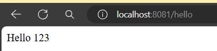

### 打包 springboot

若是想打包 springboot 須在 maven 導入 springboot 提供的插件。

```xml
    <!--springboot 提供的打包插件-->
    <build>
        <plugins>
            <plugin>
                <groupId>org.springframework.boot</groupId>
                <artifactId>spring-boot-maven-plugin</artifactId>
            </plugin>
        </plugins>
    </build>
```

接下來執行 `mvn clean package` 生成 jar 包，即可透過 `java -jar demo.jar` 運行 springboot project。

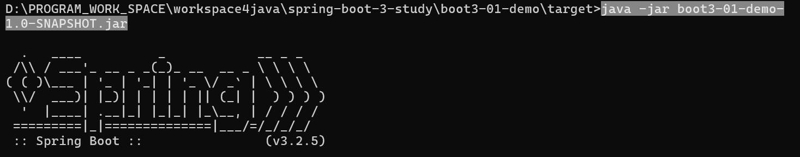

#### springboot 提供的打包插件與 maven 原生的差別

>##### jar 檔差別
>
>- maven 打包的 jar 檔只會包含者這個 project 自身的`.class file`和 `resource file` ，並不包含者第三方依賴的 jar 檔，因此運行時得手動添加使用到的第三方依賴。
>- springboot 打包的 jar 檔會包含者 project 自身的 `.class file`和`resource file`外，也包含者第三方依賴，因此運行時只要確保環境有安裝 java，即可透過 `java -jar`運行 springboot 程式。

>##### war 檔差別
>
>- war 檔的差異則較小，不管是 maven、springboot 打包出來的 war 檔都會包含者第三方依賴，而springboot 的 war 檔則可以自由的選擇要用內嵌的 web server 還是把 springboot.war 放到外部 web server 運行。

springboot 可以直接打包成 jar 檔運行，而不必放到 web server，就是因為已經內嵌了 tomcat，而透過 springboot 插件打包出來的 jar 檔，也包含者 tomcat 等第三方依賴，因此才可直接透過 `java -jar`運行。

---

### springboot 特性總結

透過以上 quick start 可以知道 springboot 具有以下特性，或是解決了以下問題。

#### 1. 簡化整合

若是以前單獨使用 spring mvc 的場景，那如果要開發 web 功能，就需要在 pom.xml
導入 servlet、tomcat、spring-mvc 等諸多依賴，而 springboot 現在透過 maven 依賴傳遞的特性，整合了各種 Starter 啟動器，如果我們想使用 web 相關的功能，只需要導入`spring-boot-starter-web`即可，而`spring-boot-starter-web`裡面也可看到又導入了其他 Starter，譬如`spring-boot-starter-tomcat`等等。

***因此，springboot 大大的簡化了我們在 pom.xml 導入依賴的配置。***

springboot 官方提供的 Starter:[官方連結](https://docs.spring.io/spring-boot/reference/using/build-systems.html#using.build-systems.starters)

- 只要是 springboot 官方提供的 Starter，命名皆為:`spring-boot-starter-*`。

- 只要是第三方提供的 Starter，命名皆為:`*-spring-boot-starter`。

#### 2. 簡化配置

若是單獨使用 spring mvc 的話，需要自己在 web.xml 或使用 @Configuration 來配置 DispatcherServlet，還要配置 ioc container，掃描範圍等等。

但使用 springboot 後，在 springboot 都有默認配置幫我們先做了這些事情，簡化了
我們還要自己配置的步驟，若默認配置不滿足需求，也可以透過 `application.propertties`來客製化需求。

`application.properties`:

- springboot 的配置都集中在這檔案，只需要修改此檔案即可。
- 配置屬性都有默認值。
- 具體有哪些屬性:[官方文檔](https://docs.spring.io/spring-boot/appendix/application-properties/index.html#appendix.application-properties)

#### 3. 簡化維運

如果想修改一個 jar 包的一些配置，不需要再重新打包，只要在 jar 包同層的資料夾下
修改 application.properties 即可。

### Spring Initializr

就 IDEA 一個建立 springboot project 的功能，在 IDEA 2024 版已經改名成
Spring Boot 了。

## 2.原理分析

### 1. 依賴管理機制

#### 1. 為什麼導入 `spring-boot-starter-web` 就將相關的 web 依賴都導入進來?

這是因為 springboot 已經將 web 開發場景會用到的 dependency 都寫好在 `spring-boot-starter-web`裡了，若查看`spring-boot-starter-web`，會看到裡面還有個 dependency `spring-boot-starter-tomcat`，而這個 `starter-tomcat`也寫好了 tomcat 會使用到的 dependency，因此只要導入`spring-boot-starter-web`，就會透過 maven 依賴傳遞的特性將這些 dependency 傳遞進來。

#### 2. 為什麼版本號都不用定義?

每個 springboot 都會繼承`spring-boot-starter-parent` 為父工程，
而`spring-boot-starter-parent` 又繼承於 `spring-boot-dependencies`，
在`spring-boot-dependencies`中會將所有版本號都定義好。

如此一來，我們就不用自己去定義版本，不用嘗試哪些版本是有衝突的。
當然沒被 `spring-boot-starter-parent` 管理到的 dependency 依然需要自己寫版本號。

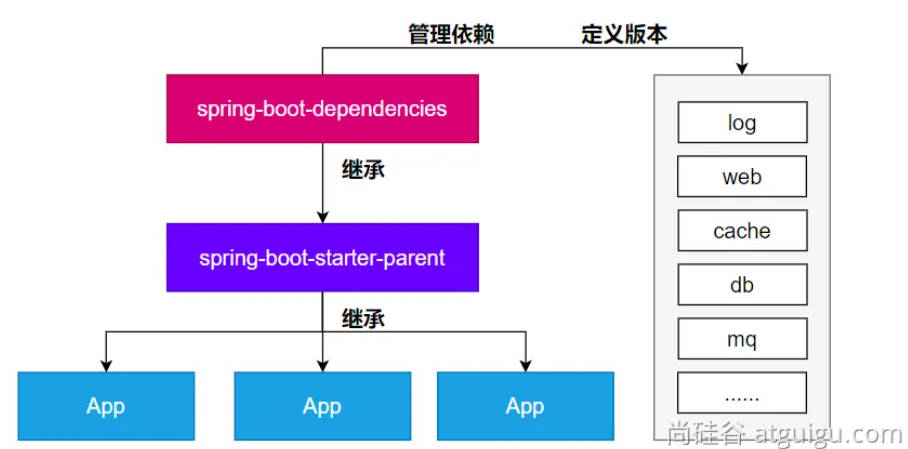

### 2. 自動配置機制

#### 1.初步理解

以前需要手動編寫 .xml 或 configuration class 去配置一些核心組件，譬如 DispatcherServlet、
ViewResolver 等等，而現在只要導入對應的 Starter 後即可馬上使用，springboot 會自動的
幫我們配置好這些組件。

以下code，若透過 IDEA debug mode 的 Evaluate Expression 去查看 `applicationContext.getBeanDefinitionNames()` 能看到裡面確實有 DispatcherServlet 這個 Bean。

```java
@SpringBootApplication
public class Boot302DemoApplication {

    public static void main(String[] args) {
        ConfigurableApplicationContext applicationContext = SpringApplication.run(Boot302DemoApplication.class, args);
        System.out.println("stop");
    }
}
```

##### 默認的 package scan 規則

- 以前需要在 .xml 或 @ComponentScan 去指定包掃描的路徑，而在 springboot 中預設就是**掃描主程序class所在的 package 及其子 package**。
- @SpringBootApplication Annotation 所在的 class 即是主程序 class。
- 若想自定義掃描路徑，可透過 `@SpringBootApplication(scanBasePackages = "path")` 或 添加`@ComponentScan` 在主程序上，之所以可以這麼做，是因為`@SpringBootApplication`本來就是由`@ComponentScan`所組成的。

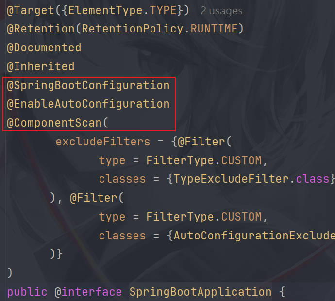

##### 配置屬性的默認值

在 application.properties 中，實際上每個屬性都會被綁定到某個 class 的屬性上。
譬如以 `server.port` 為例，若對 application.properties 的 `server.port` 用 ctrl + 左鍵
會導到 `ServerProperties.class` 上，而所有的屬性都是如此，會被綁定到某個 class 上。

##### 簡介自動配置的原理

若觀察`spring-boot-starter-web`等 starter，會看到都導入了一個`spring-boot-starter`，而這個`spring-boot-starter`又導入了`spring-boot-autoconfigure`，而這個`spring-boot-autoconfigure`編寫了很多 autoconfiguration class，只要導入對應的 starter，就會開啟哪個 starter 的 autoconfiguration class。

至於這些 autoconfigutation class 具體是在哪邊被 springboot 執行，目前還沒弄懂。

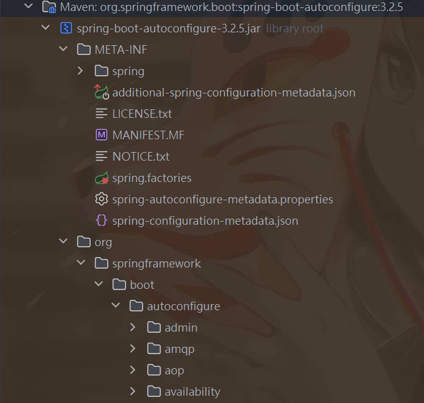

## 3. 常用註解、條件註解

### 1. 常用註解

這邊的 Annotation 功能要搞明白，後續自動配置原理會用到。

因為除了 @import 外都明白功能，故只介紹 @import。

### @import

@import 的功能是用來導入 class 成為 Bean，而組件的名字為全類名。

```java
@Configuration
@Import(要導入的 class)
public class MyConfig {
}
```

### 2. 條件註解

@ConditionalOnClass：如果類路徑中存在這個類，則觸發指定行為

@ConditionalOnMissingClass：如果類路徑中不存在這個類，則觸發指定行為

@ConditionalOnBean：如果容器中存在這個Bean（元件），則觸發指定行為

@ConditionalOnMissingBean：如果容器中不存在這個Bean（組件），則觸發指定行為

如果條件註解是加到 configuration class 上的話，則註解生效，整個 configuration class 才生效。

如果是加到 @Component class 上，效果會不會是條件註解生效，才把 class 加到 IOC 呢，還有待測試。

#### 條件註解範例

 先添加 druid dependency，然後配置以下 configuration。

 ```java
 @Configuration
public class MyConfig {

    @Bean
    @ConditionalOnClass(name="com.alibaba.druid.FastsqlException")
    public Cat cat01() {
        return new Cat();
    }

    @Bean
    @ConditionalOnMissingClass(value = "com.alibaba.druid.FastsqlException")
    public Dog dog01() {
        return new Dog();
    }
}
 ```

可以看到是 cat01 被加入到 IOC。

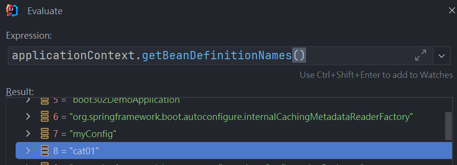

### 3.屬性綁定

將 IOC Container 中的 Bean 的屬性值與配置文件(application.properties)的配置項的值進行綁定。

- @ConfigurationProperties

- @EnableConfigurationProperties

#### @ConfigurationProperties 範例

`@ConfigurationProperties`並不會把 Class 放到 IOC Container，因此要自己手動加上
`@Component` 或 `@Bean`。

>application.properties
>
>```properties
>pig.id=1
>pig.name=瓜瓜
>pig.age=21
>```

>Pig Class
>
>```java
>// 要記得加上 setter、getter 給底層調用
>@ConfigurationProperties(prefix = "pig")
>@Component
>@Data
>public class Pig {
>    Integer id;
>    String name;
>    Integer age;
>}
>```

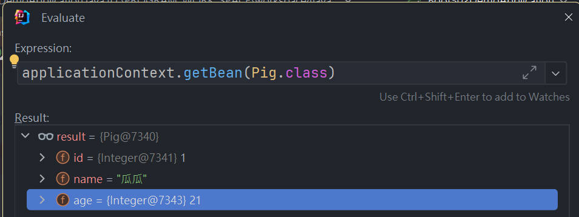

#### @EnableConfigurationProperties 範例

- 功能與`@ConfigurationProperties`一樣，差別在`@EnableConfigurationProperties`
會把 Class 註冊到 IOC Container，下圖能看到使用了`@Import`。

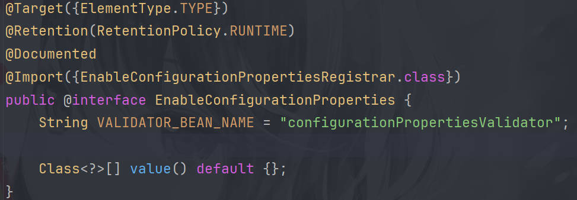

- 通常用於導入第三方庫成為 Bean 且進行屬性綁定。

## SpringBoot 自動配置完整流程

以`spring-boot-starter-web`為例。

1. 導入`spring-boot-starter-web`後會透過依賴傳遞導入`spring-boot-starter`，而這個`spring-boot-starter`是所有 starter 都會導入的一個依賴，是自動配置的核心依賴。

2. `spring-boot-starter`也會透過依賴傳遞導入`spring-boot-autoconfigure`，而`spring-boot-autoconfigure`則定義了各個 starter 的 autoconfiguration class，像是在`package org.springframework.boot.autoconfigure.web.servlet`下就定義了`DispatcherServletAutoConfiguration.class`。
從下圖可以看到，只要class path下有者`DispatcherServlet.class`就會啟動這個自動配置類。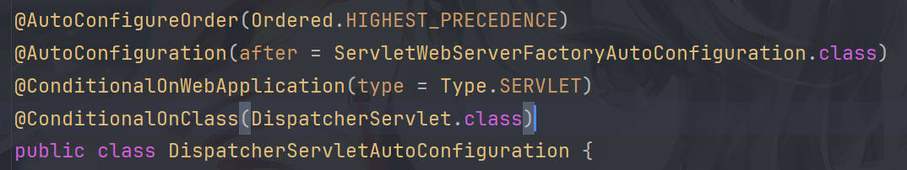
而在`DispatcherServletAutoConfiguration`裡有個 Method 能看到就是註冊`DispatcherServlet`的。

```java
@Bean(name = DEFAULT_DISPATCHER_SERVLET_BEAN_NAME)
public DispatcherServlet dispatcherServlet(WebMvcProperties webMvcProperties) {
    DispatcherServlet dispatcherServlet = new DispatcherServlet();
    dispatcherServlet.setDispatchOptionsRequest(webMvcProperties.isDispatchOptionsRequest());
    dispatcherServlet.setDispatchTraceRequest(webMvcProperties.isDispatchTraceRequest());
    configureThrowExceptionIfNoHandlerFound(webMvcProperties, dispatcherServlet);
    dispatcherServlet.setPublishEvents(webMvcProperties.isPublishRequestHandledEvents());
    dispatcherServlet.setEnableLoggingRequestDetails(webMvcProperties.isLogRequestDetails());
    return dispatcherServlet;
}
```

>能看到 `spring-boot-autoconfigure.org`下寫了所有 starter 的 autoconfigure。
>
>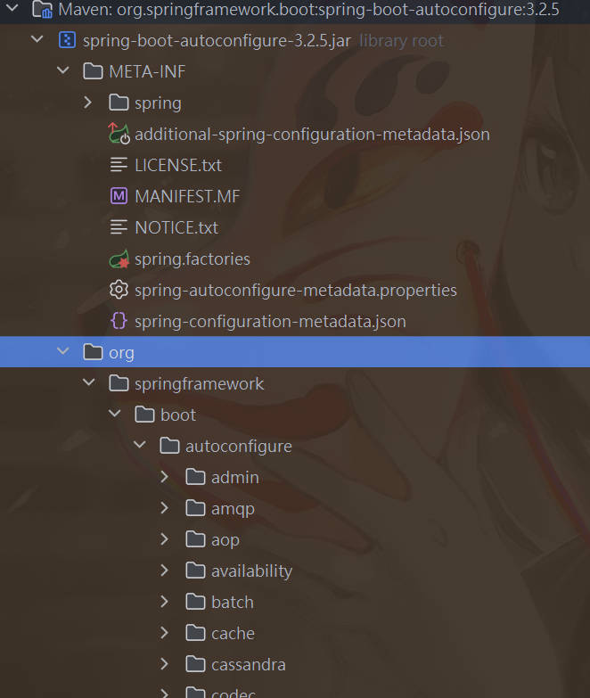

3. 雖然在`spring-boot-autoconfigure`已經寫好了所有 starter 的自動配置，但 springboot 默認只掃描 `@SpringBootApplication` 所在的 package 及其子包，是掃不到`spring-boot-autoconfigure`下的配置類的，因此 spring-boot 是透過`@SpringBootApplication`->`@EnableAutoConfiguration`->`@Import(AutoConfigurationImportSelector.class)`先去註冊`AutoConfigurationImportSelector`成為 Bean 後，然後調用`AutoConfigurationImportSelector.getAutoConfigurationEntry()`方法去獲得 auto configuration class，其中在`getAutoConfigurationEntry()`裡會看到調用了`getCandidateConfigurations()`，而就是在這裡去獲得`spring-boot-autoconfigure`裡的自動配置類的。

>`AutoConfigurationImportSelector.getCandidateConfigurations()`
>
>實際上是透過 `ImportCandidates.load` 去加載配置類的，點進去能看到實際上去加載配置類的 path 就是 META-INF/spring/org.springframework.boot.autoconfigure.AutoConfiguration.imports，而在 imports 裡則定義了所有自動配置類的 path。
>
>```java
>protected List<String> getCandidateConfigurations(AnnotationMetadata metadata, >AnnotationAttributes attributes) {
>    List<String> configurations = ImportCandidates.load(AutoConfiguration.class, >getBeanClassLoader())
>		.getCandidates();
>	Assert.notEmpty(configurations,
>			"No auto configuration classes found in "
>					+ ".META-INF/spring/org.springframework.boot.autoconfigure.>AutoConfiguration.imports If you "
>					+ "are using a custom packaging, make sure that file is correct.");
>	return configurations;
>}
>```
>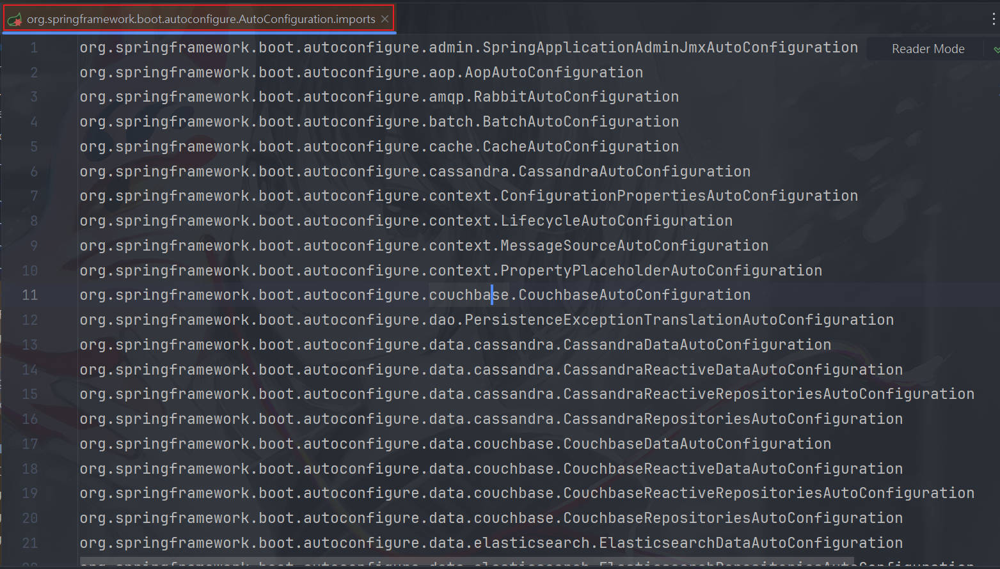
